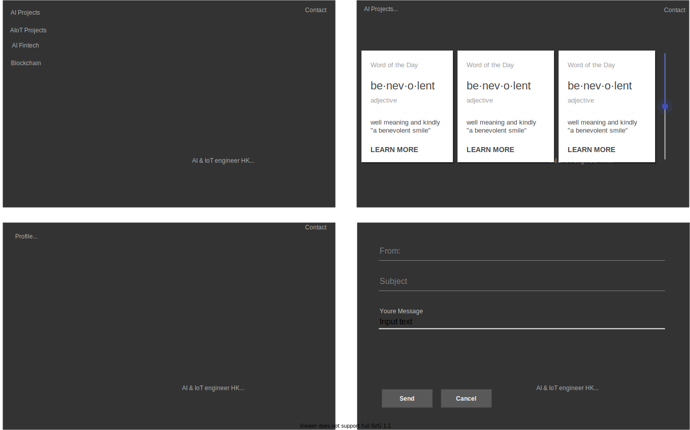
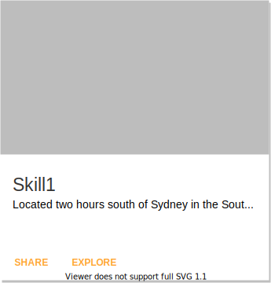

# My engineering web site overview

- [My engineering web site overview](#my-engineering-web-site-overview)
  - [Page Image](#page-image)
  - [Top page](#top-page)
  - [Project page](#project-page)
  - [Profile page](#profile-page)
    - [Skills](#skills)
    - [Experiences](#experiences)
  - [Common parts](#common-parts)
    - [Contact information](#contact-information)
    - [SNS](#sns)
  - [Technologies](#technologies)
    - [Front-end to implement with Angular](#front-end-to-implement-with-angular)
    - [Back-end to implement with SQL in Azure](#back-end-to-implement-with-sql-in-azure)
      - [SKills](#skills-1)
        - [Query](#query)
        - [Tables](#tables)
          - [Skill](#skill)
          - [Project](#project)
          - [Skill_Project](#skill_project)
      - [Experiences](#experiences-1)
        - [Query](#query-1)
        - [Tables](#tables-1)
          - [Experience](#experience)

## Page Image



## Top page

Simply explains what I am and what I can.

## Project page

Display the demo applications in tiles.
By clicking each tiles, it jumps to the applications to explain my work.

## Profile page

### Skills

Skills tiled with material UI cards.
Jumps to the site of the implementation using the skill.


| element | description|
|:--|:--|
|PNG file| The top Web Site screen shot.(also has the link to the site) |
|SKILL Name| Skill name listed in DB. |
|Description| Skill Description in DB |
|Share | For visitors to share the skill card in Linkdin |
|Exlore | Link to the Web Site |

### Experiences

## Common parts

### Contact information

Implemented in chat bots to respond to the readers' questions.
Collect requesters contact information

### SNS

Linkd-in
GitHub

## Technologies

### Front-end to implement with Angular

```
ng new pome
ng generate component title
ng generate component portofolio_list
ng generate component portofoliopage
ng generate component profile_skills
ng generate component skill_card
ng generate component profile_experiences
ng generate component experience_card
ng generate component profile_about
ng generate component profilepage
```

### Back-end to implement with SQL in Azure

#### SKills

##### Query

```
SELECT Skill.id, Skill.item, Skill.level, Skill.description, Project.name, Project.description, Project.url
FROM Skill
LEFT JOIN Skill_Project ON Skill.id = Skill_Project.skill_id
LEFT JOIN Project ON Skill_Project.project_id = Project.id
```

##### Tables

###### Skill

- id
- item
- level

```
CREATE TABLE IF NOT EXISTS Skill (
  id INT NOT NULL PRIMARY KEY AUTO_INCREMENT,
  item VARCHAR(20) NOT NULL,
  description TEXT,
  level VARCHAR(10) NOT NULL,
)
```

###### Project

- id
- name
- url

```
CREATE TABLE IF NOT EXISTS Project (
  id INT NOT NULL PRIMARY KEY AUTO_INCREMENT,
  name VARCHAR(256) NOT NULL,
  description TEXT NOT NULL,
  url TEXT NOT NULL,
)
```

###### Skill_Project

- skill_id
- project_id

```
CREATE TABLE Skill_Project (
  id INT NOT NULL PRIMARY KEY AUTO_INCREMENT,
  CONSTRAINT fk_skill_id
    FOREIGN KEY (skill_id) 
    REFERENCES Skill (id)
    ON DELETE RESTRICT ON UPDATE RESTRICT,
  CONSTRAINT fk_project_id
    FOREIGN KEY (project_id) 
    REFERENCES Project (id)
    ON DELETE RESTRICT ON UPDATE RESTRICT,
)
```

#### Experiences

##### Query

```
SELECT Experience.name, Experience.from, Experience.to, Experience.role, Project.name, Project.url
FROM Experience, Project
WHERE Experience.project_id = Project.id
```

##### Tables

###### Experience

- id
- name
- from
- to
- role
- statement
- (fk)project

```
CREATE TABLE IF NOTE EXISTS Experience (
  id INT NOT NULL PRIMARY KEY AUTO_INCREMENT,
  name VARCHAR(128) NOT NULL,
  from DATE,
  to DATE,
  role VARCHAR(64)
  statement TEXT
  CONSTRAINT fk_project_id
    FOREIGN KEY (project_id) 
    REFERENCES Project (id)
    ON DELETE RESTRICT ON UPDATE RESTRICT
)
```