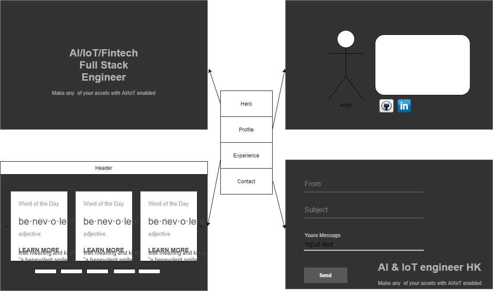
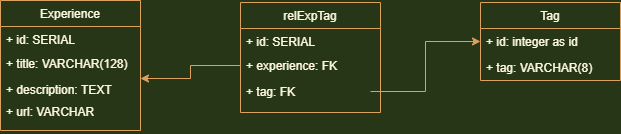
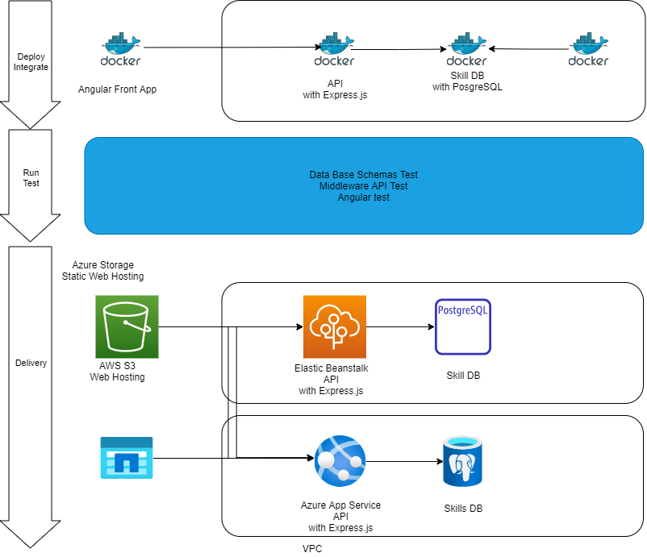

# My engineering web site overview

- [My engineering web site overview](#my-engineering-web-site-overview)
  - [Page Design](#page-design)
    - [Pages](#pages)
      - [Top page](#top-page)
      - [Profile Page](#profile-page)
      - [Experiences page](#experiences-page)
      - [Contact](#contact)
    - [Implementation with Angular](#implementation-with-angular)
      - [Comopnents](#comopnents)
        - [top](#top)
        - [profile](#profile)
        - [experiences-head](#experiences-head)
        - [experiences-container](#experiences-container)
        - [experiences-content](#experiences-content)
        - [experience-card](#experience-card)
        - [contact](#contact-1)
      - [Services](#services)
        - [experiences-api](#experiences-api)
  - [Middleware with express.js and Backend DB](#middleware-with-expressjs-and-backend-db)
    - [Architecture](#architecture)
      - [API](#api)
        - [Database](#database)
      - [Experience](#experience)
        - [Model](#model)
        - [Funcions](#funcions)
        - [Endpoint API](#endpoint-api)
          - [GET /api/experience/list?tag=<tagid>](#get-apiexperiencelisttagtagid)
          - [GET /api/experience/:idx](#get-apiexperienceidx)
          - [POST /api/experience (token requied)](#post-apiexperience-token-requied)
          - [PUT /api/experience (token requied)](#put-apiexperience-token-requied)
          - [DELETE /experience/:id (token requied)](#delete-experienceid-token-requied)
        - [Table](#table)
      - [Tag](#tag)
        - [Model](#model-1)
        - [Model Functions](#model-functions)
        - [Endpoint API](#endpoint-api-1)
          - [GET /api/tag/list](#get-apitaglist)
          - [GET /api/tag/"tag name"](#get-apitagtag-name)
          - [POST /api/tag/"tag name" (token required)](#post-apitagtag-name-token-required)
          - [DELETE /api/tag/"tag name" (token required)](#delete-apitagtag-name-token-required)
        - [Tables](#tables)
        - [relexptag](#relexptag)
      - [Application User](#application-user)
        - [Model](#model-2)
        - [Endpoint API](#endpoint-api-2)
          - [/api/user/login](#apiuserlogin)
          - [GET /api/user/list [token required]](#get-apiuserlist-token-required)
          - [GET /api/user/:id](#get-apiuserid)
          - [POST /api/user [token required]](#post-apiuser-token-required)
          - [DELETE /api/user/:id [token required]](#delete-apiuserid-token-required)
        - [Tables](#tables-1)
      - [Inquiry](#inquiry)
        - [Model](#model-3)
        - [Endpoint API](#endpoint-api-3)
        - [Tables](#tables-2)
    - [How to launch and Deploy](#how-to-launch-and-deploy)
      - [Launch locally with Docker Composer](#launch-locally-with-docker-composer)
      - [Deploy](#deploy)
        - [Deploy and Integration with Docker-Composer](#deploy-and-integration-with-docker-composer)
          - [Environment variables](#environment-variables)
          - [PostreSQL](#postresql)
          - [pgadmin4||](#pgadmin4)
          - [express + node:latest|](#express--nodelatest)
          - [Angular + node:latest|](#angular--nodelatest)
        - [Test](#test)
        - [Target](#target)
          - [To AWS](#to-aws)
          - [To Azure](#to-azure)
## Page Design



### Pages
#### Top page

Simply explains what I am and what I can.


#### Profile Page

#### Experiences page

Display the demo applications in tiles.
By clicking each tiles, it jumps to the applications to explain my work.

Skills tiled with material UI cards.
Jumps to the site of the implementation using the skill.


| element | description|
|:--|:--|
|PNG file| The top Web Site screen shot.(also has the link to the site) |
|SKILL Name| Skill name listed in DB. |
|Description| Skill Description in DB |
|Share | For visitors to share the skill card in Linkdin |
|Exlore | Link to the Web Site |

#### Contact

### Implementation with Angular


```sh
ng new pome
ng generate component top
ng generate component profile
ng generate component experiences-head
ng generate component experiences-container
ng generate component experiences-content
ng generate component experience-card
ng generate component contact

ng generate service experiences-api
```

#### Comopnents

##### top
##### profile
##### experiences-head
##### experiences-container
##### experiences-content
##### experience-card
##### contact

#### Services

##### experiences-api

## Middleware with express.js and Backend DB

### Architecture

#### API
##### Database



#### Experience

##### Model

```js
export type Experience = {
  id?: number, // -1 if not assigned in DB
  title: string,
  description: string,
  url?: string
};
```

##### Funcions
The functions created to exchange the model.

```js
list(idxTag?: number): Experience[]
get(idx: number): Experience
create(experience: Experience): Experience {}
update(experience: Experience): Experience {}
delete(id: number): Experience {}
```

- list(tagid?: number): Experience[]
  - list all the experiences
  - list all the experiences tagged with the

- get(idx: number): Experience

- create(experience: Experience): Experience {}

- update(experience: Experience): Experience {}

- delete(id: number): Experience {}


##### Endpoint API

###### GET /api/experience/list?tag=<tagid>

| code | result | When |
|-|-|-|
| 200 | Success | Found entry and responded |

Return list of experiences.
The tagid is optional to get the category tag of the experience.

The following is returned in the response.

```js
[
  {
    id: number
    title: string,
    description: string,
    url?: string
  },
  ...
]
```

###### GET /api/experience/:idx

Return an experience by index.

| code | result | When |
|-|-|-|
| 200 | Success | Found entry and responded |
| 404 | Not Found | The entry with the id is not found |

The following is returned in the response.
```js
{
  id: number,
  title: string,
  description: string,
  url?: string
};
```

###### POST /api/experience (token requied)

| code | result | When |
|-|-|-|
| 201 | Created | Successfully created |
| 401 | Unauthorized | token not acceptale |
| 406 | Not acceptale | failed in the request with bad format or data |
| 409 | Conflict | Already exists with the same title |

Create and experience.

Create an experience with the following formant.
If the title is duplicated, return an error resopnse (409).

- request body
```js
{
  id: number,
  title: string,
  description: string,
  url?: string
};
```

When correctly registered return code (201) returned with the created entry with an assigned id.
- response body
```js
{
  id: number,
  title: string,
  note: string,
  url?: string
};
```

###### PUT /api/experience (token requied)

| code | result | When |
|-|-|-|
| 200 | Created | Successfully update |
| 401 | Unauthorized | token not acceptable |
| 404 | Not Found | the experience entry is not found in DB |
| 406 | Not acceptale | failed in the request with bad format or data |

- request
```js
{
  id: number,
  title: string,
  description: string,
  url?: string
};
```

- response
```js
{
  id: number,
  title: string,
  description: string,
  url?: string
};
```

###### DELETE /experience/:id (token requied)

| code | result | When |
|-|-|-|
| 200 | OK | Successfully deleted |
| 400 | Bad request | token not accepted |
| 404 | Not Found | When there is no entry with the id |

```js
{
  id: number,
  title: string,
  description: string,
  url?: string
};
```


##### Table

```sql
CREATE TABLE IF NOT EXISTS experience (
  id SERIAL,
  title VARCHAR NOT NULL,
  note TEXT,
  urle VARCHAR,
  PRIMARY KEY (id)
);
```


#### Tag

##### Model

```js
export type Tag = {
  id?: number, // -1 if not assigned in DB
  tag: string
};
```

##### Model Functions
```js
list(): Tag[]
get(idx: number): Tag
create(tag: string): Tag {}
delete(tag: string): Tag {}
```


##### Endpoint API

###### GET /api/tag/list

| code | result | When |
|-|-|-|
| 200 | Success | Found entry and responded |

###### GET /api/tag/"tag name"

| code | result | When |
|-|-|-|
| 200 | Success | Found entry and responded |
| 404 | Not Found | The entry with the tag name is not found |

###### POST /api/tag/"tag name" (token required)


| code | result | When |
|-|-|-|
| 201 | Created | Successfully created |
| 400 | Bad request | token not acceptale or no name specified |
| 409 | Conflict | Already exists with the same title |

###### DELETE /api/tag/"tag name" (token required)


| code | result | When |
|-|-|-|
| 200 | OK | Successfully deleted |
| 400 | Bad request | token not accepted |
| 404 | Not Found | When there is no entry with the tag name |

##### Tables


```sql
CREATE TABLE IF NOT EXISTS tag (
  id SERIAL,
  tag VARCHAR(8) NOT NULL,
  PRIMARY KEY (id),
  CONSTRAINT tag_unique UNIQUE (tag)
);
```

##### relexptag

```sql
CREATE TABLE IF NOT EXISTS relexptag (
    id SERIAL,
    experience INT,
        FOREIGN KEY (experience)
        REFERENCES experience (id),
    tag INT,
        FOREIGN KEY (tag)
        REFERENCES tag (id),
    PRIMARY KEY (id)
);
```


#### Application User

##### Model

```js
export type User = {
  id: number, // -1 if not assigned in DB
  name: string,
  email: string,
  passwd: string,
};
```

```js
login()
async list(): Promise<User[]>\
async get(id: number): Promise<User>
async get(id: number): Promise<User>
async create(u: User): Promise<User>
async update(u: User): Promise<User>
async delete(id: number): Promise<User>
async authenticate(email: string, password: string): Promise<User | null>
```
##### Endpoint API

###### /api/user/login


For registered user, you can login by sending below in your request body.

```
{
    email: string;
    passwd: string;
}
```

In the response body, you get below. Extract the token from below and set as *Authorization: Bearer <token>*, where you find **[token required]**.

```
{
    email: string;
    token: string;
}
```

###### GET /api/user/list [token required]

| code | result | When |
|-|-|-|
| 200 | Success | Found entry and responded |
\
Get a list of users.

###### GET /api/user/:id

| code | result | When |
|-|-|-|
| 200 | Success | Found entry and responded |
| 404 | Not Found | The entry with the user id is not found |

###### POST /api/user [token required]


| code | result | When |
|-|-|-|
| 201 | Created | Successfully created |
| 401 | Unauthorized | token not acceptale or no name specified |
| 409 | Conflict | Already exists with the same user email |


Set the following in the request body.
```
{
    id: number,
    user: string,
    email: string,
    passwd: string
}
```

###### DELETE /api/user/:id [token required]

| code | result | When |
|-|-|-|
| 200 | OK | Successfully deleted |
| 401 | Unauthorized | token not accepted |
| 404 | Not Found | When there is no entry with the user id |

##### Tables

The email and passwd should be hashed.

```sql
CREATE TABLE IF NOT EXISTS lvl (
  id SERIAL,
  user VARCHAR,
  email VARCHAR,
  passwd VARCHAR,
  PRIMARY KEY (id)
);
```

#### Inquiry

##### Model

##### Endpoint API

##### Tables


```sql
CREATE TABLE IF NOT EXISTS inquiry (
  id SERIAL,
  sender VARCHAR,
  title VARCHAR,
  note TEXT,
  PRIMARY KEY (id)
);
```

### How to launch and Deploy

#### Launch locally with Docker Composer

| tool | version |
|:--|--:|
| docker-compose | 1.25.5 |
| Docker | 20.10.8 |
| Node.js | 16.13.0 |
| npm | 6.14.8 |
| Angular CLI | 12.2.12 |

To launch the application for a local integration test,
run the ui, middle api and database server with Docker Composer as a daemon.

```sh
cd DockerComposer
sudo docker-compose -up d
```

To shut down.

```sh
cd DockerComposer
sudo docker-compose -down
```

If you want to clear up the environment, after a local integration, run below.

```sh
docker rm -f $(docker ps -a -q)
docker volume rm $(docker volume ls -q)
```

#### Deploy

Target environment.
Here I am going to try deploying to both AWS and Azure.



##### Deploy and Integration with Docker-Composer

(c.f. https://circleci.com/docs/ja/2.0/docker-compose/)

###### Environment variables


###### PostreSQL

```
   postgres:<br>
        image: postgres:latest<br>
        container_name: postgres<br>
        ports:<br>
            - '5432:5432'<br>
        env_file:<br>
            - .env<br>
        volumes:<br>
            - 'postgres:/var/lib/postgresql/data'<br>
            - ./db/schema.sql:/docker-entrypoint-initdb.d/1-schema.sql<br>
            - ./db/data.sql:/docker-entrypoint-initdb.d/2-data.sql<br>
        networks:<br>
            - backend<br>
        hostname: postgres<br>
        restart: always|<br>|

```

###### pgadmin4||

###### express + node:latest|

###### Angular + node:latest|

##### Test

Launch docker compose in circle CI and run the test script

```js
docker-compose up -d
npm run api_test
docker-compose down
```

##### Target
###### To AWS

Set up PosgtreSQL environment with the following command.

```sh
```

https://docs.aws.amazon.com/ja_jp/AmazonS3/latest/userguide/WebsiteHosting.html

Set up Elasti Beanstalk environment with the following command.

```sh
```

https://docs.aws.amazon.com/ja_jp/elasticbeanstalk/latest/dg/using-features.managing.db.html

Set up S3 bucket for Web Hosting with the following command.

```sh
```

###### To Azure

Set up PosgtreSQL environment with the following command.

```sh
```

https://docs.microsoft.com/ja-jp/azure/developer/python/how-to-create-static-sites

Set up Azure AppService environment with the following command.

```sh
```


https://docs.microsoft.com/ja-jp/azure/postgresql/flexible-server/tutorial-webapp-server-vnet

Set up Azure Storage for Web Hosting with the following command.

```sh
```